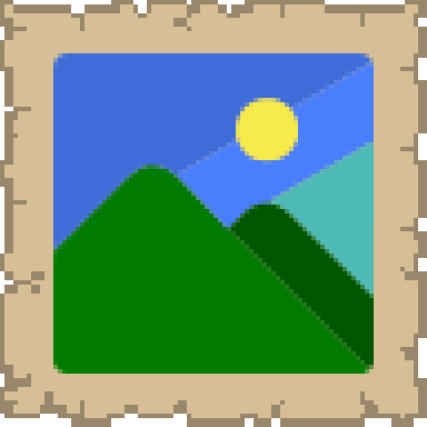
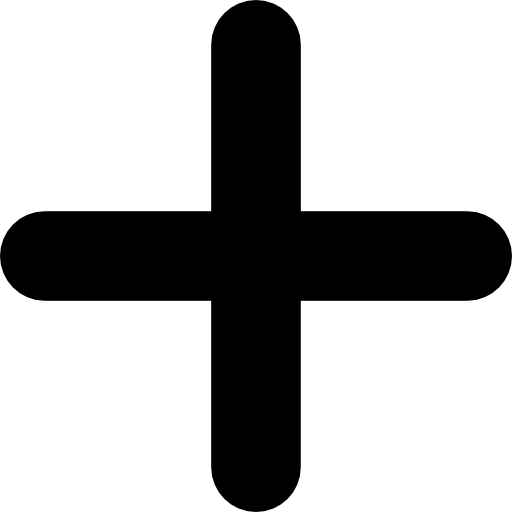
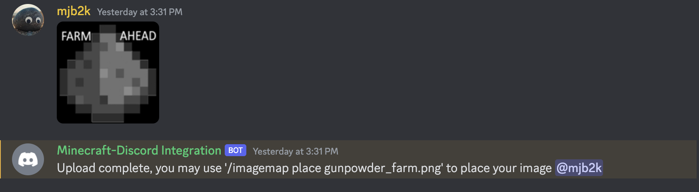

  

# Imagemaps-Discord-Bot
This plugin is meant to hook a discord bot with 
imagemaps that allow discord users to upload PNG files on discord that are then
made available to them in-game via imagemaps.

# Execution
0. Move the jar file into your plugins folder and create the imagemapbot directory with the preset config.yml
1. First, you'll need an existing bot on your discord server, 
you can check out the "Creating the bot" section of this [guide](https://github.com/dominik-korsa/discord-integration/wiki/Configuring-a-Discord-bot) to create one,
or if you already have one you can move on to the next step
2. Copy and paste your bots token into the discord-token field in config.yml
3. Copy and paste the channel id(s) you wish to have image submissions uploaded in the config.yml. 
(you may need to change your view to developer in Discord)
4. Change the path field in config.yml to be the absolute path to your ImageMaps/images directory.
5. Test by uploading an image to your submissions channel and seeing the success reply.

# Credit
Much of the codebase is based off an [existing Discord plugin](https://github.com/mjb2k/discord-integration) I built this integration
natively on, and was written by
[Dominik Korsa](https://github.com/dominik-korsa). Most of the client, main file, Config and
Exception work was done by him and made this project considerably easier to implement.

# Why redo the integration?
It came to me that building another plugin for the integration was a better idea
than letting it live in the other discord bot. This is because there are several different
Discord bot plugins, and limiting this feature to just one is not robust. This plugin is
not meant to host a standalone discord bot, though it's capable of doing that. Rather, this plugin
should hook into an existing bot on your server from one of those other plugins. All you need to do
is set the discord-token field to the token of one of your existing bots, and setup the channelIds accordingly as well. 

Todo:
* Finish README
* Verify images are multiples of 128x128
